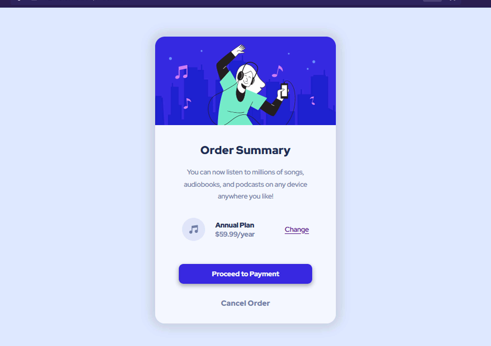

# Frontend Mentor - Order summary card solution

This is a solution to the [Order summary card challenge on Frontend Mentor](https://www.frontendmentor.io/challenges/order-summary-component-QlPmajDUj). Frontend Mentor challenges help you improve your coding skills by building realistic projects.

## Table of contents

- [Overview](#overview)
  - [The challenge](#the-challenge)
  - [Screenshot](#screenshot)
  - [Links](#links)
- [My process](#my-process)
  - [Built with](#built-with)
  - [What I learned](#what-i-learned)
  - [Continued development](#continued-development)
- [Author](#author)

## Overview

### The challenge

Users should be able to:

- See hover states for interactive elements

### Screenshot

### Links

- Solution URL: [Add solution URL here](https://your-solution-url.com)
- Live Site URL: [Add live site URL here](https://your-live-site-url.com)

## My process

Similar to the last chalenge of frontendmentor (the nft card), this time i tried to use relative units and have a better structure overall.

### Built with

- html
- CSS
- Flexbox

### What I learned

To have a better structured process, i did first the html markup, then i went from top to bottom making the hole card.

### Continued development

I will continue leveling up my skills with this fun challenges.

## Author

- Frontend Mentor - [@FabricioRivera2021](https://www.frontendmentor.io/profile/FabricioRivera2021)
- Github - [FabricioRivera2021](https://github.com/FabricioRivera2021)
